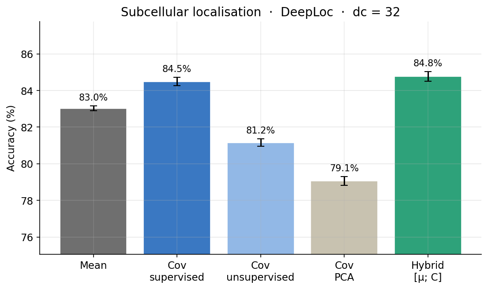
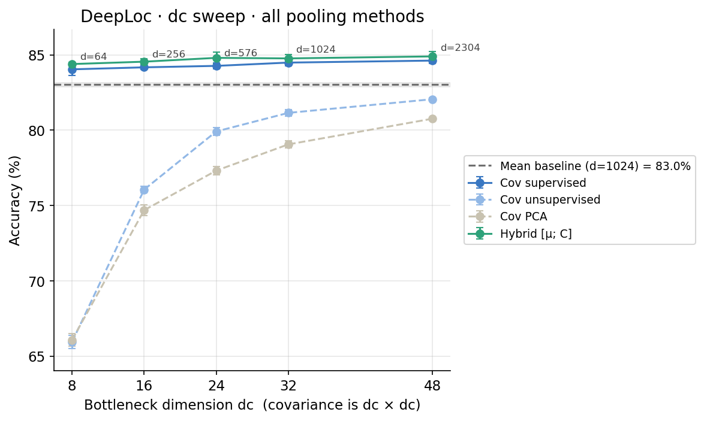
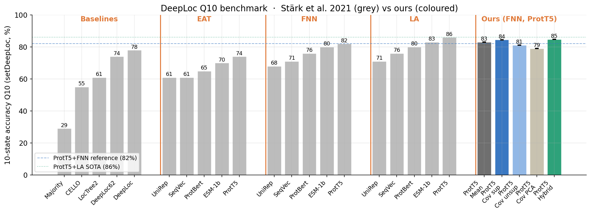
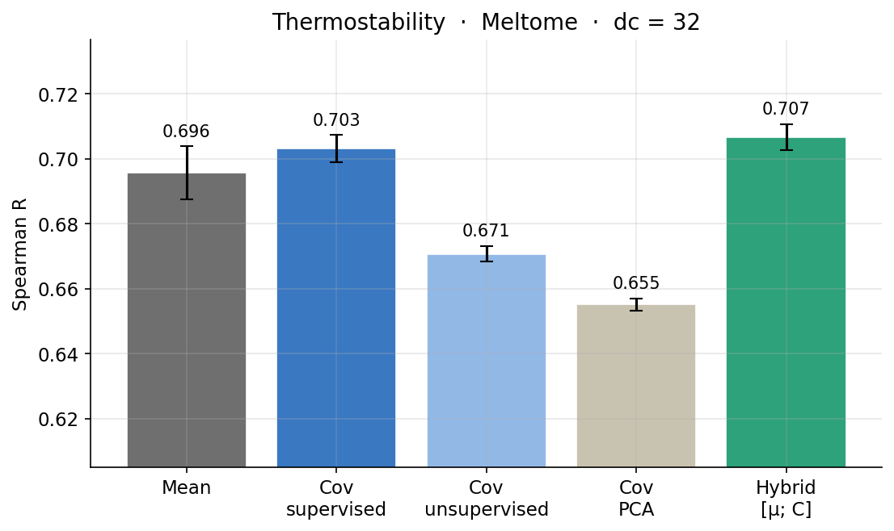

# Second-Order Pooling for Protein Language Models

**PP1 SoSe2026 · TU Munich · Chair of Bioinformatics I12**

Team: Joel Simon · Julius Schmidt · Lisa Börner · Andreas Weitz

---

## Research Question

Does compressing per-residue ProtX embeddings via **covariance pooling** improve downstream task performance compared to mean pooling, and at what bottleneck dimension does it become parameter-efficient?

## Method

Given per-residue embeddings **X** ∈ ℝ^{L×d} from frozen ProtX:

| Method | Formula | Output dim | Trainable params |
|---|---|---|---|
| Mean (baseline) | μ = (1/L) Xᵀ𝟏 | d | 0 |
| Covariance, supervised | C = (1/L)(XL)ᵀ(XR), L, R trained end-to-end | dc² | 2·d·dc |
| Covariance, unsupervised (autoencoder) | C = (1/L)(XL)ᵀ(XR), L, R fitted by Frobenius reconstruction of XᵀX, then frozen | dc² | 2·d·dc (frozen) |
| Covariance, PCA | C = (1/L)(XU)ᵀ(XU), U = top-dc eigenvectors of dataset Σ — closed-form, no SGD | dc² | d·dc (frozen) |
| Hybrid | [μ ; flat(C)] | d + dc² | 2·d·dc |
| Light Attention | [ Σᵢ softmax(e)ᵢ · vᵢ ; maxᵢ vᵢ ], v, e = two 1-D convs over residues | 2·d | ~2·d²·k |
| Attention-covariance | C = Σᵢ αᵢ (Uxᵢ)(Uxᵢ)ᵀ, αᵢ = light-attention weight (Σ α = 1) | dc² | d·dc + d·k |

L, R ∈ ℝ^{d×dc} are two independent learnable projections — C is asymmetric in general. The unsupervised autoencoder trains them by minimising
‖XᵀX − L (XL)ᵀ(XR) Rᵀ‖²_F using the Frobenius equivalence ‖XᵀX‖_F = ‖XXᵀ‖_F so that no per-protein d×d matrix is materialised.

The **PCA** variant is the symmetric / tied-weights special case of the autoencoder (L = R = U, so C is symmetric and PSD). It needs no training — just two streaming passes over the data and an eigendecomposition. Useful as a sanity-check baseline: does the autoencoder's extra freedom (asymmetric L, R, SGD) buy anything over the closed-form solution?

Every method feeds its pooled vector to the **same FNN probe head**, so comparisons are apples-to-apples.

### Extensions

Three additions push beyond the plain covariance pool. They compose orthogonally — you can stack all three at once.

- **Light Attention** (`light_attention`) — a reimplementation of [Stärk et al. 2021](https://doi.org/10.1093/bioinformatics/btab083). Two 1-D convolutions over the residue axis produce per-channel *values* and per-channel *attention scores*; the soft-max-weighted sum is concatenated with a channel-wise max. A first-order (vector) pool — the strong literature baseline we benchmark against.
- **Attention-weighted covariance** (`attention_cov`) — replaces the uniform `1/L` in the covariance with learned per-residue light-attention weights `αᵢ`, with a single *tied* projection `U` so `C` stays symmetric PSD. Trained end-to-end with the probe.
- **Matrix-power normalisation** (`power_norm: true`) — the [iSQRT-COV](https://doi.org/10.1109/CVPR.2018.00100) trick (Li et al. 2018): map `C → C^{1/2}` in its eigenbasis via a differentiable Newton–Schulz iteration *before* flattening. This flattens the heavy-tailed eigenvalue spectrum (condition number ~10⁴ → ~10²) and moves the SPD matrix toward its Log-Euclidean tangent space, so the linear probe sees a far better-conditioned input. A toggle on every covariance method, not a method of its own. See [docs/matrix_power_normalisation.md](docs/matrix_power_normalisation.md) for the full derivation.

The natural **full stack** is `ProtX → light-attention-weighted residues → C → C^{1/2} → vec → FNN` (`attention_cov` with `power_norm: true`).

## Results

Headline numbers from the core grid (frozen ProtT5 embeddings, FNN probe head, mean ± std over 3 seeds, `dc = 32`). Full table: [results/visualization/summary_table.tsv](results/visualization/summary_table.tsv); regenerate every figure with `python scripts/make_plots.py --results <runs_dir> --out results/visualization`.

### Subcellular localisation (DeepLoc, 10-class accuracy)

Second-order pooling beats mean pooling, and the **hybrid [μ ; C]** is best (84.8% vs 83.0% mean). The covariance carries information the mean discards.



A `dc` sweep shows *why* the **supervised** covariance is the parameter-efficient winner: at `dc = 8` (a 64-dim pool) it already matches mean pooling's 1024-dim vector, while the frozen unsupervised/PCA pools need a much larger `dc` to catch up.



Placed against the [Stärk et al. 2021](https://doi.org/10.1093/bioinformatics/btab083) benchmark, our ProtT5 + FNN covariance/hybrid pools (coloured) land in the same band as their ProtT5 + FNN bar and approach the ProtT5 + Light-Attention SOTA (86%) — using only an FNN head.



### Thermostability (Meltome, Spearman R)

The same ranking holds on regression — hybrid (0.707) and supervised covariance (0.703) edge out the mean baseline (0.696).



> **Note:** the Light-Attention, attention-covariance, and matrix-power (`*_sqrt`) results are not yet in the table above — run [colab_run_remaining_experiments.ipynb](colab_run_remaining_experiments.ipynb) to fill in those rows, then re-run `make_plots.py`.

## Project Structure

```
├── src/sop/
│   ├── pooling/
│   │   ├── base.py            # Pooler(nn.Module) interface
│   │   ├── mean.py            # MeanPooler
│   │   ├── covariance.py      # CovariancePooler — two learnable projections L, R
│   │   ├── covariance_pca.py  # CovariancePCAPooler — closed-form top-dc PCA
│   │   ├── hybrid.py          # HybridPooler — [μ ; flat(C)] concat
│   │   ├── light_attention.py # LightAttentionPooler — Stärk et al. 2021
│   │   ├── attention_covariance.py # AttentionCovariancePooler — LA-weighted cov
│   │   └── matrix_power.py    # isqrt_cov — differentiable C^{1/2} (Newton–Schulz)
│   ├── unsupervised/
│   │   └── frobenius_trainer.py   # autoencoder for ‖XᵀX − L C̃ Rᵀ‖²_F
│   ├── probes/
│   │   ├── fnn.py             # ProbeFNN (1 hidden layer, ReLU + dropout)
│   │   ├── model.py           # PoolingProbeModel = pooler + probe
│   │   ├── dataset.py         # ProteinEmbeddingDataset + collate_pad
│   │   ├── train_loop.py      # generic torch train loop (CE / MSE)
│   │   └── metrics.py         # accuracy, Spearman R
│   ├── data/store.py          # HDF5 embedding store
│   ├── utils/masking.py       # make_mask, apply_mask
│   └── analysis/              # aggregation + plots + cov visualisations
├── scripts/
│   ├── extract_embeddings.py     # ProtX → HDF5 (supports --layers for sweep)
│   ├── train_unsupervised_pool.py# fit + freeze the autoencoder (SGD)
│   ├── fit_pca_pool.py           # fit + freeze the PCA pooler (closed-form)
│   ├── run_experiment.py         # train pooler + probe → JSON in results/runs/
│   └── make_plots.py             # JSON runs → figures + summary_table.tsv
├── configs/
│   ├── scl/{mean,cov_supervised,cov_unsupervised,cov_pca,hybrid,
│   │        light_attention,attention_cov,attention_cov_sqrt,cov_supervised_sqrt}.yaml
│   └── meltome/{ … same set … }.yaml
├── docs/matrix_power_normalisation.md   # iSQRT-COV derivation + references
├── tests/                     # pytest suite (masking invariance + correctness)
└── data/
    ├── raw/{deeploc,meltome}/  # FASTA + label CSVs (not tracked)
    └── embeddings/             # HDF5 caches (not tracked)
```

## Setup

```bash
conda env create -f environment.yml
conda activate sop
pip install -e .
```

> **GPU note:** edit [environment.yml](environment.yml) to swap `pytorch-cuda` for `cpuonly` if running without a GPU. Don't have both active at once.

ProtX inference is GPU-heavy; we run it on Google Colab and download the resulting HDF5 caches into `data/embeddings/`. All downstream training (probe head, autoencoder, analysis) runs locally on the cached tensors.

## Workflow

### 1 · Extract per-residue embeddings (once per split, on Colab)

```bash
python scripts/extract_embeddings.py \
    --sequences data/raw/deeploc/train.fasta \
    --model /path/to/protx_checkpoint \
    --output data/embeddings/deeploc_train.h5 \
    --batch-size 4 --device cuda
```

For the layer sweep, request multiple hidden states in one pass — each one becomes its own H5:

```bash
python scripts/extract_embeddings.py \
    --sequences data/raw/deeploc/train.fasta \
    --model /path/to/protx_checkpoint \
    --output data/embeddings/deeploc_train.h5 \
    --layers last 4 12 24 \
    --batch-size 4 --device cuda
```

### 2 · (Optional) Fit a frozen unsupervised pooler once

Two flavours, both reusable across tasks via `pretrained_path` in the configs:

```bash
# Frobenius autoencoder — learnable L, R via SGD
python scripts/train_unsupervised_pool.py \
    --embeddings data/embeddings/deeploc_train.h5 \
    --d 1024 --dc 32 \
    --epochs 5 --batch-size 32 --lr 1e-3 \
    --output models/unsup_pooler_dc32.pt

# PCA — closed-form top-dc eigenvectors of the dataset covariance
python scripts/fit_pca_pool.py \
    --embeddings data/embeddings/deeploc_train.h5 \
    --d 1024 --dc 32 \
    --output models/pca_pooler_dc32.pt
```

### 3 · Run experiments

```bash
# Mean pooling baseline
python scripts/run_experiment.py --config configs/scl/mean.yaml

# Supervised covariance (L, R trained with the probe)
python scripts/run_experiment.py --config configs/scl/cov_supervised.yaml

# Frozen unsupervised covariance (autoencoder, loads pretrained_path)
python scripts/run_experiment.py --config configs/scl/cov_unsupervised.yaml

# PCA covariance (closed-form, loads pretrained_path)
python scripts/run_experiment.py --config configs/scl/cov_pca.yaml

# Hybrid [μ ; flat(C)]
python scripts/run_experiment.py --config configs/scl/hybrid.yaml

# Light Attention (Stärk et al. 2021) — first-order baseline
python scripts/run_experiment.py --config configs/scl/light_attention.yaml

# Matrix-power-normalised covariance (C → C^{1/2})
python scripts/run_experiment.py --config configs/scl/cov_supervised_sqrt.yaml

# Attention-weighted covariance, and the full LA + cov + matrix-power stack
python scripts/run_experiment.py --config configs/scl/attention_cov.yaml
python scripts/run_experiment.py --config configs/scl/attention_cov_sqrt.yaml

# dc sweep (any covariance method; light_attention has no dc and ignores --dc)
python scripts/run_experiment.py \
    --config configs/scl/cov_supervised.yaml \
    --dc 8 16 24 32 48
```

Results land under `results/runs/` as one JSON per (config, dc) with per-seed and aggregated metrics. Turn a directory of those JSONs into the full figure suite + `summary_table.tsv` with `python scripts/make_plots.py --results results/runs --out results/visualization`.

### 4 · Tests

```bash
pytest
```

91 tests covering masking invariance (every pooler, including light-attention and attention-covariance), the Frobenius reconstruction identity, the differentiable matrix square root (`C^{1/2} @ C^{1/2} ≈ C`, symmetry, spectrum compression, gradient flow), `power_norm` checkpoint round-trips, and the probe train-loop on both classification and regression.

## Label CSV format

Both `train_labels.csv` and `test_labels.csv` need a header row and two columns:

```
id,label
P12345,nucleus
Q67890,cytoplasm
```

For Meltome, `label` is a floating-point melting temperature (°C).

## Experiments

| Config | Task | Metric |
|---|---|---|
| `configs/scl/*.yaml` | Subcellular localisation (10-class) | Accuracy |
| `configs/meltome/*.yaml` | Thermostability (regression) | Spearman R |

Each task directory holds the same nine methods: `mean`, `cov_supervised`, `cov_unsupervised`, `cov_pca`, `hybrid`, plus the extensions `light_attention`, `attention_cov`, `attention_cov_sqrt`, and `cov_supervised_sqrt`.

Core grid: 5 base pooling methods × 2 tasks × 3 seeds = 30 runs. Extensions add 4 methods × 2 tasks × 3 seeds. dc sweep: dc ∈ {8, 16, 24, 32, 48} on both tasks. Layer sweep: re-run with embeddings from different ProtX layers.

The base-method runs are done (see [Results](#results)); the extension runs are driven from [colab_run_remaining_experiments.ipynb](colab_run_remaining_experiments.ipynb).
